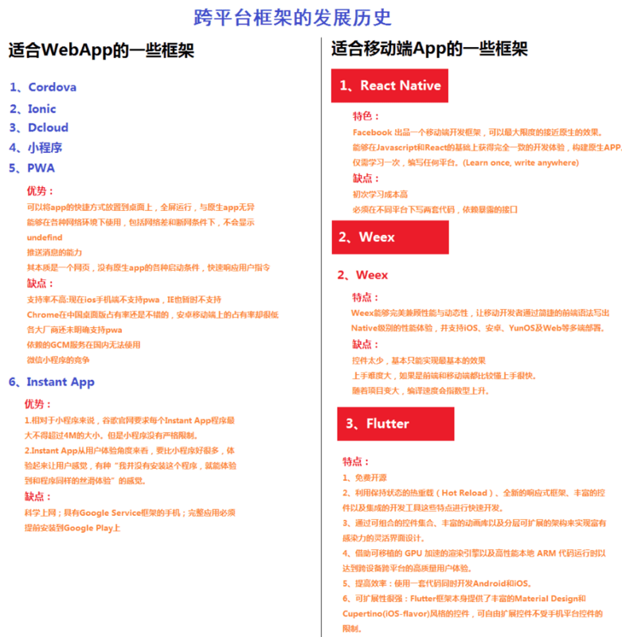

[Flutter中文网：简介](https://flutterchina.club/)

[Flutter中文网:教程](https://flutterchina.club/tutorials/)

[Flutter从入门到寄几玩儿](https://segmentfault.com/a/1190000016602108)

[【开发经验】浅谈flutter的优点与缺点](https://segmentfault.com/a/1190000017164263?utm_source=tag-newest)

[推荐 技术胖: Flutter 44集免费基础视频教程](https://juejin.im/post/5c452bac6fb9a049af6d919a)

2018年6月21日Google发布Flutter首个release预览版,Google baba大力推出的一种基于【dart语言】、全新的【响应式】，【跨平台】，【高性能】的移动开发框架.

Flutter是谷歌的移动UI框架，可以快速在iOS和Android上构建高质量的原生用户界面。 

Flutter可以与现有的代码一起工作。

在全世界，Flutter正在被越来越多的开发者和组织使用，并且Flutter是完全免费、开源的。

它也是构建未来的Google Fuchsia应用的主要方式。

# 为什么要使用Flutter?

- 提高开发效率
- 同一份代码开发iOS和Android
- 用更少的代码做更多的事情
- 轻松迭代
- 在应用程序运行时更改代码并重新加载（通过热重载）
- 修复崩溃并继续从应用程序停止的地方进行调试
- 创建美观，高度定制的用户体验
- 受益于使用Flutter框架提供的丰富的Material Design和Cupertino（iOS风格）的widget
- 实现定制、美观、品牌驱动的设计，而不受原生控件的限制

快速开发

> 毫秒级的热重载，修改后，您的应用界面会立即更新。使用丰富的、完全可定制的widget在几分钟内构建原生界面。

富有表现力和灵活的UI

> 快速发布聚焦于原生体验的功能。分层的架构允许您完全自定义，从而实现难以置信的快速渲染和富有表现力、灵活的设计。

原生性能

> Flutter包含了许多核心的widget，如滚动、导航、图标和字体等，这些都可以在iOS和Android上达到原生应用一样的性能。

