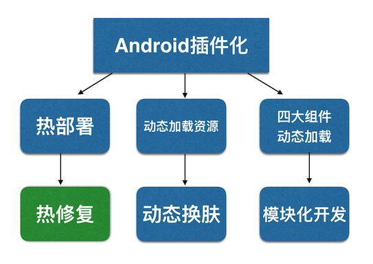

GitHub上最火的Android开源项目,所有开源项目都有详细资料和配套视频
https://github.com/open-android/Android

android sdk 源码解析
https://github.com/LittleFriendsGroup/AndroidSdkSourceAnalysis

Android基础知识、Android进阶知识、Android自定义View相关、面试相关的知识
https://github.com/linsir6/AndroidNote

Blankj/AndroidOfferKiller
https://github.com/Blankj/AndroidOfferKiller


# handler


handler机制
https://www.baidu.com/s?ie=utf-8&f=8&rsv_bp=1&tn=baidu&wd=handler%E6%9C%BA%E5%88%B6&oq=Android%25E7%2583%25AD%25E4%25BF%25AE%25E5%25A4%258D%25E5%258E%259F%25E7%2590%2586&rsv_pq=ede0945f00003a32&rsv_t=1065QBM0tgjUydCncrjYX8gbRSlSY1861HEXY9g4Bh2fcK25QtO9Gkj9dUg&rqlang=cn&rsv_enter=0&inputT=545&rsv_sug3=39&rsv_sug1=36&rsv_sug7=101&sug=handler%25E6%259C%25BA%25E5%2588%25B6&rsv_n=1&bs=Android%E7%83%AD%E4%BF%AE%E5%A4%8D%E5%8E%9F%E7%90%86

handler机制郭林
https://www.baidu.com/s?ie=utf-8&f=3&rsv_bp=1&tn=baidu&wd=handler%E6%9C%BA%E5%88%B6%E9%83%AD%E6%9E%97&oq=handler%25E6%259C%25BA%25E5%2588%25B6&rsv_pq=e4e940d200004077&rsv_t=ddf52CGALMRHIIuorqsdWGBvhFBG2mX%2FTljsCdlbUdgJlGN%2BSd5pe8f4934&rqlang=cn&rsv_enter=0&rsv_sug3=42&rsv_sug1=39&rsv_sug7=100&rsv_sug2=1&prefixsug=handler%25E6%259C%25BA%25E5%2588%25B6&rsp=2&rsv_sug4=6361

# 虚拟机

art虚拟机
https://www.baidu.com/s?ie=utf-8&f=8&rsv_bp=1&tn=baidu&wd=art%E8%99%9A%E6%8B%9F%E6%9C%BA&oq=handler%25E6%259C%25BA%25E5%2588%25B6%25E9%2583%25AD%25E6%259E%2597&rsv_pq=8f3af6fd0000436c&rsv_t=c7e77yZ6iGmIp7b26%2FZstNcsaVfMM1Ena49nVlreYdR4yKZTD4j9%2BN00vOQ&rqlang=cn&rsv_enter=0&rsv_sug3=70&rsv_sug1=52&rsv_sug7=100&bs=handler%E6%9C%BA%E5%88%B6%E9%83%AD%E6%9E%97

art虚拟机dex加载流程
https://www.baidu.com/s?ie=utf-8&f=3&rsv_bp=1&tn=baidu&wd=art%E8%99%9A%E6%8B%9F%E6%9C%BAdex%E5%8A%A0%E8%BD%BD%E6%B5%81%E7%A8%8B&oq=art%25E8%2599%259A%25E6%258B%259F%25E6%259C%25BA&rsv_pq=f241105d00004d7b&rsv_t=84ace1S0GXX8a%2BwxxgkXepoujLIVYNrekGGsSU3T79V25Z4exCn1eAcSO7s&rqlang=cn&rsv_enter=0&inputT=2864&rsv_sug3=91&rsv_sug1=78&rsv_sug7=100&rsv_sug2=1&prefixsug=art%25E8%2599%259A%25E6%258B%259F%25E6%259C%25BA&rsp=1&rsv_sug4=3103

art虚拟机formips
https://www.baidu.com/s?ie=utf-8&f=3&rsv_bp=1&tn=baidu&wd=art%E8%99%9A%E6%8B%9F%E6%9C%BAformips&oq=art%25E8%2599%259A%25E6%258B%259F%25E6%259C%25BAdex%25E5%258A%25A0%25E8%25BD%25BD%25E6%25B5%2581%25E7%25A8%258B&rsv_pq=dc38f1e900005004&rsv_t=34e65JaZT0roH7b1WF4du6raAGzuGQRth619kFOR9c2a2IKUXVcQ7IeX4bs&rqlang=cn&rsv_enter=0&inputT=2710&rsv_sug3=101&rsv_sug1=88&rsv_sug7=100&rsv_sug2=1&prefixsug=art%25E8%2599%259A%25E6%258B%259F%25E6%259C%25BA&rsp=2&rsv_sug4=18623&rsv_sug=1

art虚拟机 架构
https://www.baidu.com/s?ie=utf-8&f=3&rsv_bp=1&tn=baidu&wd=art%E8%99%9A%E6%8B%9F%E6%9C%BA%20%E6%9E%B6%E6%9E%84&oq=art%25E8%2599%259A%25E6%258B%259F%25E6%259C%25BAformips&rsv_pq=e0b7e80600005a1c&rsv_t=9147fKf7eYBHjp43vFzwVcA%2FMuw4wyYfnsu8OlxwdwqN%2FCNHnbF2BDYcgSs&rqlang=cn&rsv_enter=0&inputT=4488&rsv_sug3=112&rsv_sug1=99&rsv_sug7=100&rsv_sug2=1&prefixsug=art%25E8%2599%259A%25E6%258B%259F%25E6%259C%25BA&rsp=2&rsv_sug4=6648&rsv_sug=2

# binder

binder机制
https://www.baidu.com/s?ie=utf-8&f=8&rsv_bp=1&tn=baidu&wd=binder%E6%9C%BA%E5%88%B6&oq=art%25E8%2599%259A%25E6%258B%259F%25E6%259C%25BA%2520%25E6%259E%25B6%25E6%259E%2584&rsv_pq=d4f0daa1000051fb&rsv_t=82e5h%2BaacWkla7oRlCTBIcw8p%2FUvOIVQ6pY9ov487g3pmq7OE82Prin9ck0&rqlang=cn&rsv_enter=0&inputT=4488&rsv_sug3=121&rsv_sug1=108&rsv_sug7=100&sug=binder%25E6%259C%25BA%25E5%2588%25B6&rsv_n=1&bs=art%E8%99%9A%E6%8B%9F%E6%9C%BA%20%E6%9E%B6%E6%9E%84

android binder机制详解
https://www.baidu.com/s?ie=utf-8&f=8&rsv_bp=1&tn=baidu&wd=android%20binder%E6%9C%BA%E5%88%B6%E8%AF%A6%E8%A7%A3&oq=binder%25E6%259C%25BA%25E5%2588%25B6&rsv_pq=ef3ea4c800005968&rsv_t=ba64uZxNz%2FdI%2FsCWsZX2sLUfAnlG8Co7dIPT59DRed1biwToxzzOGINLlWA&rqlang=cn&rsv_enter=0&inputT=3383&rsv_sug3=138&rsv_sug1=123&rsv_sug7=100&sug=android%2520binder%25E6%259C%25BA%25E5%2588%25B6%25E8%25AF%25A6%25E8%25A7%25A3&rsv_n=1&bs=binder%E6%9C%BA%E5%88%B6

android 进程线程通信
https://www.baidu.com/s?ie=utf-8&f=3&rsv_bp=1&tn=baidu&wd=android%20%E8%BF%9B%E7%A8%8B%E7%BA%BF%E7%A8%8B%E9%80%9A%E4%BF%A1&oq=android%2520binder%25E6%259C%25BA%25E5%2588%25B6%25E8%25AF%25A6%25E8%25A7%25A3&rsv_pq=db88e97e00006076&rsv_t=e72aRCSe%2ByNWUduSbtD%2FOCkZSvPlw0ojCPuGglhp22VsphbXrrnL2ycl9Ng&rqlang=cn&rsv_enter=0&inputT=32657&rsv_sug3=147&rsv_sug1=125&rsv_sug7=100&rsv_sug2=1&prefixsug=android%2520binder%25E6%259C%25BA%25E5%2588%25B6&rsp=0&rsv_sug4=35024

android aidl 的实现
https://www.baidu.com/s?ie=utf-8&f=3&rsv_bp=1&tn=baidu&wd=android%20aidl%20%E7%9A%84%E5%AE%9E%E7%8E%B0&oq=android%2520%25E8%25BF%259B%25E7%25A8%258B%25E7%25BA%25BF%25E7%25A8%258B%25E9%2580%259A%25E4%25BF%25A1&rsv_pq=e854c79f000062ce&rsv_t=1c13WLNYt2yzohPToO93onFFEKdFogLKa7hg4aIAYsvcBl4iARBQGVMR80A&rqlang=cn&rsv_enter=0&inputT=25464&rsv_sug3=182&rsv_sug1=170&rsv_sug7=100&rsv_sug2=1&prefixsug=android%2520binder%25E6%259C%25BA%25E5%2588%25B6&rsp=1&rsv_sug4=42232

# eventbus

eventbus 原理
https://www.baidu.com/s?ie=utf-8&f=3&rsv_bp=1&tn=baidu&wd=eventbus%20%E5%8E%9F%E7%90%86&oq=android%2520aidl%2520%25E7%259A%2584%25E5%25AE%259E%25E7%258E%25B0&rsv_pq=cc1a8c3700006714&rsv_t=919210QeZrKrTYiiFN%2Bu%2B6FvDq4LXwrM5j9f9d7y1h8xGjHiJz6n2Hn0PmY&rqlang=cn&rsv_enter=0&inputT=47721&rsv_sug3=228&rsv_sug1=221&rsv_sug7=100&rsv_sug2=1&prefixsug=eventbus%2520&rsp=3&rsv_sug4=48240

[EventBus 源码解析](http://p.codekk.com/blogs/detail/54cfab086c4761e5001b2538)

[ouyangshengduo/SenduoBus](https://github.com/ouyangshengduo/SenduoBus)

# Volley 

[Volley 源码解析](http://p.codekk.com/blogs/detail/54cfab086c4761e5001b2542)

[Volley手写属于自己的万能网络访问框架](https://www.cnblogs.com/ganchuanpu/p/9083000.html)

[xq_android / CustomVolley](https://gitee.com/android100/CustomVolley)

# glide

glide原理
https://www.baidu.com/s?ie=utf-8&f=8&rsv_bp=1&tn=baidu&wd=glide%20%E5%8E%9F%E7%90%86&oq=eventbus%2520%25E5%258E%259F%25E7%2590%2586&rsv_pq=9a51a7c700006947&rsv_t=b733iJJ9MjKSLd%2FKK25TAijF6xQAKiV03%2BRCm0v4fypWh5co9EuBwlPn0%2FE&rqlang=cn&rsv_enter=0&inputT=1243&rsv_sug3=237&rsv_sug1=228&rsv_sug7=100&rsv_sug2=0&rsv_sug4=25753

[Android Glide缓存策略分析](https://www.jianshu.com/p/d2006e47dc87)

# 组件化

android组件化开发
https://www.baidu.com/s?ie=utf-8&f=3&rsv_bp=1&tn=baidu&wd=android%E7%BB%84%E4%BB%B6%E5%8C%96%E5%BC%80%E5%8F%91&oq=Android%2520%25E7%25BB%2584%25E4%25BB%25B6%25E5%258C%2596&rsv_pq=d889a1210000a5dd&rsv_t=838alQdqI9Qn9Vhxpe2VnIpA61cVDPp4%2F1RJdrQi2iGaybdmD2mDT1aulik&rqlang=cn&rsv_enter=1&rsv_sug3=2&rsv_sug1=2&rsv_sug7=100&rsv_sug2=1&prefixsug=Android%25E7%25BB%2584%25E4%25BB%25B6%25E5%258C%2596&rsp=0&inputT=2071&rsv_sug4=2809

android 组件化开发
https://www.baidu.com/s?ie=utf-8&f=3&rsv_bp=1&tn=baidu&wd=android%20%E7%BB%84%E4%BB%B6%E5%8C%96%E5%BC%80%E5%8F%91&oq=android%25E7%25BB%2584%25E4%25BB%25B6%25E5%258C%2596%25E5%25BC%2580%25E5%258F%2591&rsv_pq=eecb36e20000a77a&rsv_t=1732TLqhlZ1FVCDGHwMXn0def85CqeLmt73LlJtxYynAXuS1h70YmqbPKVg&rqlang=cn&rsv_enter=1&rsv_sug3=10&rsv_sug1=10&rsv_sug7=100&rsv_sug2=1&prefixsug=android%25E7%25BB%2584%25E4%25BB%25B6%25E5%258C%2596%25E5%25BC%2580%25E5%258F%2591&rsp=1&rsv_sug4=34457&rsv_sug=1

android组件化开发面试
https://www.baidu.com/s?ie=utf-8&f=3&rsv_bp=1&tn=baidu&wd=android%E7%BB%84%E4%BB%B6%E5%8C%96%E5%BC%80%E5%8F%91%E9%9D%A2%E8%AF%95&oq=android%2520%25E7%25BB%2584%25E4%25BB%25B6%25E5%258C%2596%25E5%25BC%2580%25E5%258F%2591&rsv_pq=f8eadd0f0000a6ef&rsv_t=a1f9FF0D4ZWxJgWg0tUMvWiUlWOa%2B8e86WSQ6Dz%2BOdg9pyv7gGYOef4Ek1A&rqlang=cn&rsv_enter=1&rsv_sug3=16&rsv_sug1=16&rsv_sug7=100&rsv_sug2=1&prefixsug=android%25E7%25BB%2584%25E4%25BB%25B6%25E5%258C%2596%25E5%25BC%2580%25E5%258F%2591&rsp=3&inputT=1489&rsv_sug4=25920&rsv_sug=1

# 插件化

android插件化
https://www.baidu.com/s?ie=utf-8&f=3&rsv_bp=1&tn=baidu&wd=android%E6%8F%92%E4%BB%B6%E5%8C%96&oq=android%25E6%258F%2592%25E4%25BB%25B6%25E5%258C%2596&rsv_pq=9b5fd4e500009d28&rsv_t=270bcboKXilpv4GtWpuNAnvWoydKymBp0xTb7CTeHYd97cEQciqeBUEB7dU&rqlang=cn&rsv_enter=0&rsv_sug3=35&rsv_sug1=35&rsv_sug7=100&prefixsug=android%25E6%258F%2592%25E4%25BB%25B6%25E5%258C%2596&rsp=3&rsv_sug4=19217&rsv_sug=1

android插件化原理
https://www.baidu.com/s?ie=utf-8&f=3&rsv_bp=1&tn=baidu&wd=android%E6%8F%92%E4%BB%B6%E5%8C%96%E5%8E%9F%E7%90%86&oq=android%25E6%258F%2592%25E4%25BB%25B6%25E5%258C%2596%25E5%25BC%2580%25E5%258F%2591&rsv_pq=d9d90e8f0000a250&rsv_t=a8ddjTD78Izh45wandcvqe1LhpissCr863j6pnt%2FxeQo8RsFW9mXcGYxohc&rqlang=cn&rsv_enter=0&rsv_sug3=37&rsv_sug1=37&rsv_sug7=100&rsv_sug2=1&prefixsug=android%25E6%258F%2592%25E4%25BB%25B6%25E5%258C%2596%25E5%25BC%2580%25E5%258F%2591&rsp=2&rsv_sug4=3408&rsv_sug=1



# 热修复

Tinker热修复原理
https://www.baidu.com/s?wd=Tinker%E7%83%AD%E4%BF%AE%E5%A4%8D%E5%8E%9F%E7%90%86

andfix热修复原理
https://www.baidu.com/s?wd=andfix%E7%83%AD%E4%BF%AE%E5%A4%8D%E5%8E%9F%E7%90%86

Android热修复原理
https://www.baidu.com/s?ie=utf-8&f=8&rsv_bp=1&tn=baidu&wd=Android%E7%83%AD%E4%BF%AE%E5%A4%8D%E5%8E%9F%E7%90%86&oq=Android%2520%25E7%2583%25AD%25E4%25BF%25AE%25E5%25A4%258D%25E5%258E%259F%25E7%2590%2586&rsv_pq=b6571627000035fc&rsv_t=dfb4n1HYTXWK7uYB0zTs4SrN%2BJ2A9Bg1ujOv4bzPjDVc0UqISlKr3NgT2Eg&rqlang=cn&rsv_enter=0&rsv_sug3=17&rsv_sug1=14&rsv_sug7=100&rsv_sug2=0&inputT=545&rsv_sug4=3211

微信：tinker

微信针对QQ空间超级补丁技术的不足提出了一个提供DEX差量包，整体替换DEX的方案。

主要的原理是与QQ空间超级补丁技术基本相同，区别在于不再将patch.dex增加到elements数组中，而是差量的方式给出patch.dex，

然后将patch.dex与应用的classes.dex合并，然后整体替换掉旧的DEX，达到修复的目的。

QQ：Qzone

支付宝：andfix ：方法的替换，把有bug的方法替换成补丁文件中的方法

美团：robust

手机淘宝：dexposed

关于Android热修复的几种解决方案
https://blog.csdn.net/wy12345432452/article/details/77482554

Android 热修复，没你想的那么难
https://kymjs.com/code/2016/05/08/01/


Android中有两个ClassLoader分别为 dalvik.system.DexClassLoader 和 dalvik.system.PathClassLoader。

1、DexClassLoader可以加载jar/apk/dex，可以从SD卡中加载未安装的apk
2、PathClassLoader只能加载系统中已经安装过的apk


PathClassLoader 

它只能加载已经安装的apk。

因为 PathClassLoader 只会去读取 /data/dalvik-cache 目录下的 dex 文件。

例如我们安装一个包名为com.hujiang.xxx的 apk,那么当 apk 安装过程中，就会在/data/dalvik-cache目录下生产一个名为data@app@com.hujiang.xxx-1.apk@classes.dex的 ODEX 文件。

在使用 PathClassLoader 加载 apk 时，它就会去这个文件夹中找相应的 ODEX 文件，如果 apk 没有安装，自然会报ClassNotFoundException。

DexClassLoader 

是最理想的加载器。它的构造函数包含四个参数，分别为：

dexPath,指目标类所在的APK或jar文件的路径.类装载器将从该路径中寻找指定的目标类,该类必须是APK或jar的全路径.如果要包含多个路径,路径之间必须使用特定的分割符分隔,特定的分割符可以使用System.getProperty(“path.separtor”)获得.

dexOutputDir,由于dex文件被包含在APK或者Jar文件中,因此在装载目标类之前需要先从APK或Jar文件中解压出dex文件,该参数就是制定解压出的dex 文件存放的路径.在Android系统中,一个应用程序一般对应一个Linux用户id,应用程序仅对属于自己的数据目录路径有写的权限,因此,该参数可以使用该程序的数据路径.

libPath,指目标类中所使用的C/C++库存放的路径

classload,是指该装载器的父装载器,一般为当前执行类的装载器


热修复的原理

http://androidxref.com/4.0.4/xref/libcore/dalvik/src/main/java/dalvik/system/BaseDexClassLoader.java

http://androidxref.com/4.0.4/xref/libcore/dalvik/src/main/java/dalvik/system/DexPathList.java

DexClassLoader 包含有一个dex数组Element[] dexElements，其中每个dex文件是一个Element，当需要加载类的时候会遍历 dexElements，如果找到类则加载，如果找不到从下一个 dex 文件继续查找。

那么我们的实现就是把这个插件 dex 插入到 Elements 的最前面，这么做的好处是不仅可以动态的加载一个类，并且由于 DexClassLoader 会优先加载靠前的类，所以我们同时实现了宿主 apk 的热修复功能。


为什么 Android 不能识别 .class 文件，而只能识别 dex 文件。

因为 dex 是对 class 的优化，它对 class 做了极大的压缩

dex 将整个 Android 工程中所有的 class 压缩到一个(或几个) dex 文件中，合并了每个 class 的常量、class 版本信息等，例如每个 class 中都有一个相同的字符串，在 dex 中就只存一份就够了。所以，在Android 上，dalvik 虚拟机是无法识别一个普通 class 文件的，因为无法识别这个 class 文件的结构。

其实 dalvik 虚拟机也并不是直接读取 dex 文件的，而是在一个 APK 安装的时候，会首先做一次优化，会生成一个 ODEX 文件，即 Optimized dex。 为什么还要优化，依旧是为了效率。

只不过，Class -> dex 是为了平台无关的优化；
而 dex -> odex 则是针对不同平台，不同手机的硬件配置做针对性的优化。

就是在这一过程中，虚拟机在启动优化的时候，会有一个选项就是 verify 选项，当 verify 选项被打开的时候，就会执行一次校验，校验的目的是为了判断，这个类是否有引用其他 dex 中的类，如果没有，那么这个类会被打上一个 CLASS_ISPREVERIFIED 的标志。一旦被打上这个标志，就无法再从其他 dex 中替换这个类了。而这个选项开启，则是由虚拟机控制的。


# 模块化

android 模块化
https://www.baidu.com/s?wd=android%20%E6%A8%A1%E5%9D%97%E5%8C%96&rsv_spt=1&rsv_iqid=0xd4471dfc00094c7d&issp=1&f=8&rsv_bp=1&rsv_idx=2&ie=utf-8&rqlang=cn&tn=baiduhome_pg&rsv_enter=1&oq=%25E6%25A8%25A1%25E5%259D%2597%25E5%258C%2596&rsv_t=7d0fmt1FHDAjX8igGhDdp7a8QnBCEG7C6lSuJdxk9N%2F4uyhGGrJ3JnRVcY7ZGwXbG3G2&inputT=1777&rsv_sug3=20&rsv_sug1=14&rsv_sug7=100&rsv_pq=b6a7fef500075a0c&rsv_sug2=0&rsv_sug4=2233

android 模块化开发
https://www.baidu.com/s?wd=android%20%E6%A8%A1%E5%9D%97%E5%8C%96%E5%BC%80%E5%8F%91&rsv_spt=1&rsv_iqid=0xd4471dfc00094c7d&issp=1&f=3&rsv_bp=1&rsv_idx=2&ie=utf-8&rqlang=cn&tn=baiduhome_pg&rsv_enter=1&oq=android%2520%25E6%25A8%25A1%25E5%259D%2597%25E5%258C%2596&rsv_t=133boa%2BPkMpr5xonFEJH%2BAa1B0ZYVmubgchvLMOVtY%2FsdOstajCAaFec5yEo8eUUgn7U&rsv_pq=ea09f16d0006f3a8&rsv_sug3=24&rsv_sug1=18&rsv_sug7=100&rsv_sug2=1&prefixsug=android%2520%25E6%25A8%25A1%25E5%259D%2597%25E5%258C%2596&rsp=0&rsv_sug4=28127

android 模块化开发实例
https://www.baidu.com/s?wd=android%20%E6%A8%A1%E5%9D%97%E5%8C%96%E5%BC%80%E5%8F%91%E5%AE%9E%E4%BE%8B&rsv_spt=1&rsv_iqid=0xd4471dfc00094c7d&issp=1&f=3&rsv_bp=1&rsv_idx=2&ie=utf-8&rqlang=cn&tn=baiduhome_pg&rsv_enter=1&oq=android%2520%25E6%25A8%25A1%25E5%259D%2597%25E5%258C%2596%25E5%25BC%2580%25E5%258F%2591&rsv_t=717eR2BIuSQH7T1GB557zBjNQTDOomVU2ak8IMy8Y6U9kDZyRPAGNRhFdF%2BK%2FM0rSEzv&rsv_pq=c9bf08cd000773d4&rsv_sug3=28&rsv_sug1=22&rsv_sug7=100&rsv_sug2=1&prefixsug=android%2520%25E6%25A8%25A1%25E5%259D%2597%25E5%258C%2596%25E5%25BC%2580%25E5%258F%2591&rsp=2&rsv_sug4=29262

> 【组件化Component】 ≈ 【模块化module】：Arouter
> 插件化：热更新

<font color="#ff0000">【组件Component】</font>
中文称为组件，或者构件。使用非常比较广泛，它的核心意义在于复用，相对模块，对于依赖性有更高的要求。 

<font color="#ff0000">【模块Module】</font>
中文为模块或模组。它的核心意义是分离职责，属于代码级模块化的产出。
它本身是提供服务的功能逻辑，是一组具有一定内聚性代码的组合，职责明确。 

组件(Component)和模块(Module)又是一对容易混淆的名词，也常常被用来相互替换。

从设计上来看，<font color="#ff0000">【组件强调复用，模块强调职责(内聚、分离)，或者说组件是达到可复用要求的模块】</font>

摘自：http://blog.sina.com.cn/s/blog_a703eb840102xp2g.html

【组件化】开发就是将一个app分成多个模块，每个模块都是一个组件（Module），
开发的过程中我们可以让这些组件相互依赖或者单独调试部分组件等，
但是最终发布的时候是将这些组件合并统一成一个apk，这就是组件化开发。 

【插件化】开发和组件化开发略有不用，插件化开发时将整个app拆分成很多模块，
这些模块包括一个宿主和多个插件，每个模块都是一个apk（组件化的每个模块是个lib），
最终打包的时候将宿主apk和插件apk分开或者联合打包。

摘自：https://blog.csdn.net/lijizhi19950123/article/details/77945153

通信方式

模块化的通信方式，无非是相互引入；我抽取了common, 其他模块使用自然要引入这个module
组件化的通信方式，按理说可以划分为多种，主流的是隐式和路由。隐式的存在使解耦与灵活大大降低，因此路由是主流
插件化的通信方式，不同插件本身就是不同的进程了。因此通信方式偏向于Binder机制类似的进程间通信

组件化的单位是组件（module）。
插件化的单位是apk(一个完整的应用)。

# MVP

Androidmvp
https://www.baidu.com/s?wd=Androidmvp

Android MVP模式 简单易懂的介绍方式
https://blog.csdn.net/swust_zeng_zhuo_k/article/details/78760947

# rxjava

android rxjava
https://www.baidu.com/s?ie=utf-8&f=8&rsv_bp=1&tn=baidu&wd=android%20rxjava&oq=android%2520rxandroid%252Bretrofit%252Bmvp%252Bdagger2&rsv_pq=ed17c1140000aa17&rsv_t=6bd73E0rJ%2BWSKFsadeB7VqXY83kNmEFD2w9UqPoAWbjDDNoTBpkyTdIlI1g&rqlang=cn&rsv_enter=1&inputT=3346&rsv_sug3=26&rsv_sug1=26&rsv_sug7=100&rsv_sug2=0&rsv_sug4=7185

https://www.jianshu.com/c/299d0a51fdd4

[THEONE10211024/RxJavaSamples](https://github.com/THEONE10211024/RxJavaSamples)

[这可能是最好的RxJava 2.x 教程](https://www.cnblogs.com/liushilin/tag/rxjava/)

[RxJava2 Examples —— 这可能是从 RxJava1 跳到 RxJava2（学习 RxJava2 ）最好的例子 Demo](https://github.com/nanchen2251/RxJava2Examples)

[RxJavaApp 教程app](https://github.com/jiang111/RxDocs)


### 观察者
```
public interface Observer<T> {
    void onSubscribe(@NonNull Disposable d);
    void onNext(@NonNull T t);
    void onError(@NonNull Throwable e);
    void onComplete();
}

//只观察结果
public interface Consumer<T> {
    void accept(T t) throws Exception;
}
```

### 被观察者

```
public interface ObservableSource<T> {
    void subscribe(@NonNull Observer<? super T> observer);
}

public abstract class Observable<T> implements ObservableSource<T> {...}

```

```
public interface Publisher<T> {
    public void subscribe(Subscriber<? super T> s);
}

//支持背压
public abstract class Flowable<T> implements Publisher<T> {...}

```


### 兼具观察者+被观察者
```
public abstract class Subject<T> extends Observable<T> implements Observer<T> {
   
    public abstract boolean hasObservers();
    public abstract boolean hasThrowable();
    public abstract boolean hasComplete();
	
    @Nullable
    public abstract Throwable getThrowable();
	
	//线程安全
    @NonNull
    public final Subject<T> toSerialized() {
        if (this instanceof SerializedSubject) {
            return this;
        }
        return new SerializedSubject<T>(this);
    }
}

```
Subject 有两种用途：

做为observable向其他的observable发送事件
做为observer接收其他的observable发送的事件。

Subject 可以同时代表 Observer 和 Observable，允许从数据源中多次发送结果给多个观察者。

除了 onSubscribe(), onNext(), onError() 和 onComplete() 之外，所有的方法都是线程安全的。此外，你还可以使用 toSerialized() 方法，也就是转换成串行的，将这些方法设置成线程安全的。

Subject 的toSerialized()，就是用来保证 onNext() 等方法的线程安全性。

```
public final class PublishSubject<T> extends Subject<T> {...}

```

在 RxJava2 ，Subject 有几个默认的实现，下面我们对它们之间的区别做简单的说明：

> AsyncSubject:
只有当 Subject 调用 onComplete 方法时，才会将 Subject 中的最后一个事件传递给所有的 Observer。

> BehaviorSubject:
该类有创建时需要一个默认参数，该默认参数会在 Subject 未发送过其他的事件时，向注册的 Observer 发送；新注册的 Observer 不会收到之前发送的事件，这点和 PublishSubject 一致。

> PublishSubject:
不会改变事件的发送顺序；在已经发送了一部分事件之后注册的 Observer 不会收到之前发送的事件。

> ReplaySubject:
无论什么时候注册 Observer 都可以接收到任何时候通过该 Observable 发射的事件。

> UnicastSubject:
只允许一个 Observer 进行监听，在该 Observer 注册之前会将发射的所有的事件放进一个队列中，并在 Observer 注册的时候一起通知给它。

对比 PublishSubject 和 ReplaySubject，它们的区别在于新注册的 Observer 是否能够收到在它注册之前发送的事件。这个类似于 EventBus 中的 StickyEvent 即黏性事件


[RxBus学习之旅－－从入门到提高](https://www.jianshu.com/p/f43903b28cc2)

[[深入RxBus]：支持Sticky事件](https://www.jianshu.com/p/71ab00a2677b)

[[深入RxBus]：异常处理](https://www.jianshu.com/p/0493cc28a811)

[RxBus 简单使用学习](https://blog.csdn.net/senkai123/article/details/78202217)


# okhttp

okhttp源码解析
https://www.baidu.com/s?ie=utf-8&f=3&rsv_bp=1&tn=baidu&wd=okhttp%E6%BA%90%E7%A0%81%E8%A7%A3%E6%9E%90&oq=android%2520okhttp&rsv_pq=dc0108250000d63d&rsv_t=f50avEMhjG2GQi2C1p3PiEC%2FqndAhQy8WNCQ3Gw5VQJtknVmGcmqb9TbX8k&rqlang=cn&rsv_enter=1&inputT=2176&rsv_sug3=35&rsv_sug1=35&rsv_sug7=100&rsv_sug2=1&prefixsug=okhttp&rsp=1&rsv_sug4=4168

okhttp post formdata
https://www.baidu.com/s?ie=utf-8&f=3&rsv_bp=1&tn=baidu&wd=okhttp%20post%20formdata&oq=okhttp%25E6%25BA%2590%25E7%25A0%2581%25E8%25A7%25A3%25E6%259E%2590&rsv_pq=c038abed0000b438&rsv_t=3ec9cl0OCL3WDjRSbNwRKyViTHvqkn4pefyh16ybEGfgAwX%2FDDMgacoZx6E&rqlang=cn&rsv_enter=1&rsv_sug3=39&rsv_sug1=39&rsv_sug7=100&rsv_sug2=1&prefixsug=okhttp%25E6%25BA%2590%25E7%25A0%2581%25E8%25A7%25A3%25E6%259E%2590&rsp=1&rsv_sug4=27241&rsv_sug=1


okhttp 上传文件
https://www.baidu.com/s?wd=okhttp+%E4%B8%8A%E4%BC%A0%E6%96%87%E4%BB%B6

[手写okhttp ouyangshengduo/SenduoHttp](https://github.com/ouyangshengduo/SenduoHttp)

# AsyncTask

[源码解析Android中AsyncTask的工作原理](https://blog.csdn.net/iispring/article/details/50670388)

# kotlin

kotlin中文文档
http://www.kotlindoc.cn/

kotlin菜鸟教程
http://www.runoob.com/kotlin/kotlin-tutorial.html


# gradle

Gradle教程
https://www.w3cschool.cn/gradle/

https://www.yiibai.com/gradle/

https://www.baidu.com/s?wd=gradle%20%E6%95%99%E7%A8%8B&rsv_spt=1&rsv_iqid=0xf1ad161b0000a10f&issp=1&f=8&rsv_bp=1&rsv_idx=2&ie=utf-8&rqlang=cn&tn=baiduhome_pg&rsv_enter=1&oq=kotlin&rsv_t=6214oYViEoHh0NTtW%2FgcDPGG%2BXwt2w0MHLQD8sG3MZuzVQdSX%2FJyudnwfN7O%2BeNbW2UY&rsv_pq=976a373f0000675c&inputT=4390&rsv_sug3=14&rsv_sug1=13&rsv_sug7=100&sug=gradle%2520%25E6%2595%2599%25E7%25A8%258B&rsv_n=1&bs=kotlin

# Jenkins

jenkins gradle android
https://www.baidu.com/s?wd=jenkins%20gradle%20android&rsv_spt=1&rsv_iqid=0xf1ad161b0000a10f&issp=1&f=3&rsv_bp=1&rsv_idx=2&ie=utf-8&rqlang=cn&tn=baiduhome_pg&rsv_enter=1&oq=jenkins&rsv_t=dc01mYds5%2BXXrxa04O4FIOac%2FVdq3YHbzF7oUQ2tElhaCtRVGCT8QXPlL7VK13HkA4lo&rsv_pq=9d195cd9000081b3&inputT=18739&rsv_sug3=21&rsv_sug1=19&rsv_sug7=100&rsv_sug2=0&prefixsug=Jenkins%2520grad&rsp=2&rsv_sug4=40329


jenkins + gradle
https://www.baidu.com/s?wd=jenkins%20%2B%20gradle&rsv_spt=1&rsv_iqid=0xf1ad161b0000a10f&issp=1&f=3&rsv_bp=1&rsv_idx=2&ie=utf-8&rqlang=cn&tn=baiduhome_pg&rsv_enter=1&oq=jenkins%2520gradle%2520android&rsv_t=ff23ux%2Fo0HUBjQUrZDwdNIGlfJhR%2F6k59iHD6Qsj0jFaI%2BElQELZf7EpXUdUEhi6XnJs&rsv_pq=f61214910000742b&inputT=4354&rsv_sug3=34&rsv_sug1=26&rsv_sug7=100&rsv_sug2=1&prefixsug=jenkins%2520gradle%2520&rsp=1&rsv_sug4=33207


# dagger

dagger2
https://www.baidu.com/s?wd=dagger2&rsv_spt=1&rsv_iqid=0xc78b3f360000c88f&issp=1&f=3&rsv_bp=0&rsv_idx=2&ie=utf-8&tn=baiduhome_pg&rsv_enter=1&rsv_sug3=2&rsv_sug1=1&rsv_sug7=100&rsv_t=bb0aVHe0Uf6Gmc6MBgSotT2mFLOyQEbnIx1JNgvEvnh0KDxdo0dnTl8dIoYqXIvsczDr&rsv_sug2=1&prefixsug=dagger&rsp=0&inputT=3047&rsv_sug4=3159


[轻松学，听说你还没有搞懂 Dagger2](https://blog.csdn.net/briblue/article/details/75578459)


# arouter 

阿里巴巴开源的路由：https://github.com/alibaba/ARouter

arouter 
https://www.baidu.com/s?wd=arouter&rsv_spt=1&rsv_iqid=0x81855662000b096f&issp=1&f=8&rsv_bp=0&rsv_idx=2&ie=utf-8&tn=baiduhome_pg&rsv_enter=1&rsv_sug3=8&rsv_sug1=7&rsv_sug7=100&rsv_t=af5bHnGPET6SCIRx0jVX4cnAIE%2F%2BhKcuAgf%2B9ch12y1OJNuNzn%2BlleDOn4hPMRo2kMQ1&sug=arouter&rsv_n=1&rsv_sug2=0&inputT=5288&rsv_sug4=6345

arouter使用
https://www.baidu.com/s?wd=arouter%E4%BD%BF%E7%94%A8&rsv_spt=1&rsv_iqid=0x81855662000b096f&issp=1&f=3&rsv_bp=1&rsv_idx=2&ie=utf-8&rqlang=cn&tn=baiduhome_pg&rsv_enter=1&oq=arouter&rsv_t=63355WPzizcV%2FMXnhSDQSjgCyBhOzX53lKJTdncwbzXuZkveqb0%2FTI9cjW5ACHOFCurT&inputT=1984&rsv_sug3=10&rsv_sug1=12&rsv_sug7=100&rsv_pq=acc9ca380008f085&rsv_sug2=1&prefixsug=arouter&rsp=0&rsv_sug4=7545

arouter原理
https://www.baidu.com/s?wd=arouter%E5%8E%9F%E7%90%86&rsv_spt=1&rsv_iqid=0x81855662000b096f&issp=1&f=8&rsv_bp=1&rsv_idx=2&ie=utf-8&rqlang=cn&tn=baiduhome_pg&rsv_enter=1&oq=arouter%25E4%25BD%25BF%25E7%2594%25A8&rsv_t=585a5s1G5D93AXAKL9vt%2FYWRJT0ezOgPQkqRbkjPW%2FfKOcbV18LsnmIn4t2E5P7hGoEP&inputT=962&rsv_pq=a6ce7f4500073397&rsv_sug3=24&rsv_sug1=27&rsv_sug7=100&sug=arouter%25E5%258E%259F%25E7%2590%2586&rsv_n=1&bs=arouter%E4%BD%BF%E7%94%A8

arouter传值
https://www.baidu.com/s?wd=arouter%E4%BC%A0%E5%80%BC&rsv_spt=1&rsv_iqid=0x81855662000b096f&issp=1&f=3&rsv_bp=1&rsv_idx=2&ie=utf-8&rqlang=cn&tn=baiduhome_pg&rsv_enter=1&oq=arouter%25E5%258E%259F%25E7%2590%2586&rsv_t=63355WPzizcV%2FMXnhSDQSjgCyBhOzX53lKJTdncwbzXuZkveqb0%2FTI9cjW5ACHOFCurT&inputT=1699&rsv_pq=ae612de60008c5e0&rsv_sug3=31&rsv_sug1=29&rsv_sug7=100&rsv_sug2=1&prefixsug=arouter&rsp=2&rsv_sug4=17357

arouter fragment
https://www.baidu.com/s?wd=arouter%20fragment&rsv_spt=1&rsv_iqid=0x81855662000b096f&issp=1&f=3&rsv_bp=1&rsv_idx=2&ie=utf-8&rqlang=cn&tn=baiduhome_pg&rsv_enter=1&oq=arouter%25E4%25BC%25A0%25E5%2580%25BC&rsv_t=3e09wE8IC%2BU%2FxeqdrQUkFguo07F6alUAZ9KZG3xPpjCU5OKMRIFCzw7YQZ0R%2F%2BnzI9gN&inputT=1473&rsv_pq=b2507ebc0006c6dc&rsv_sug3=37&rsv_sug1=35&rsv_sug7=100&rsv_sug2=1&prefixsug=arouter&rsp=3&rsv_sug4=15448


# 注解

### 运行时注解（反射）
如：retrofit


### 编译时注解（APT （Annotation Processing Tool））
如：
DataBinding,Dagger2, ButterKnife, EventBus3 、DBFlow、AndroidAnnotation

Java注解处理器
https://www.race604.com/annotation-processing/

万能的APT！编译时注解的妙用
http://zjutkz.net/2016/04/07/%E4%B8%87%E8%83%BD%E7%9A%84APT%EF%BC%81%E7%BC%96%E8%AF%91%E6%97%B6%E6%B3%A8%E8%A7%A3%E7%9A%84%E5%A6%99%E7%94%A8/


Android 进阶 教你打造 Android 中的 IOC 框架 【ViewInject】 （上）
https://blog.csdn.net/lmj623565791/article/details/39269193


Android 进阶 教你打造 Android 中的 IOC 框架 【ViewInject】 （下）
https://blog.csdn.net/lmj623565791/article/details/39275847?utm_source=blogxgwz1


[Java语法-反射、注解（及APT）、泛型、动态代理](https://blog.csdn.net/xiaoru5127/article/details/81167853)


# ViewModel和LiveData

[Android架构组件ViewModel和LiveData案例](https://github.com/mengjingbo/ViewModelAndLiveDataSample)


基于谷歌最新AAC架构，MVVM设计模式的一套快速开发库，整合Okhttp+RxJava+Retrofit+Glide等主流模块，
满足日常开发需求。使用该框架可以快速开发一个健壮、易维护的Android应用。
https://github.com/goldze/MVVMHabit

简单使用LiveData+ViewModel
https://www.jianshu.com/p/fade79561568


[google官方：Android Jetpack: 分页库 (Paging Library) | 中文教学视频](https://mp.weixin.qq.com/s?__biz=MzAwODY4OTk2Mg==&mid=2652047421&idx=1&sn=81ad7ddddc536c1f4831a925331ac832&chksm=808ca878b7fb216ef7d152532d560ae4fbf8d55cad0a7ce1b586e31541a88e2e698def382388&mpshare=1&scene=23&srcid=1107f3PD5uqkijODpnTWWhPu#rd)


[google官方:Android Jetpack: LiveData 和 Lifecycle 介绍 | 中文教学视频](https://mp.weixin.qq.com/s?__biz=MzAwODY4OTk2Mg==&mid=2652047241&idx=1&sn=e1285c96a0f861f4692b80e321581797&chksm=808ca7ccb7fb2edab94a5a1cc378b80938959a5acafce85d0dfcb7ae6b4d755acdbe22e337cf&scene=21#wechat_redirect)

[google官方:Android Jetpack: ViewModel | 中文教学视频](https://mp.weixin.qq.com/s?__biz=MzAwODY4OTk2Mg==&mid=2652046951&idx=1&sn=210e09f63046c5ec038a49818f447c3c&scene=21#wechat_redirect)


[google官方:Android Sunflower 带您玩转 Jetpack](https://mp.weixin.qq.com/s?__biz=MzAwODY4OTk2Mg==&mid=2652046980&idx=1&sn=648a3a1ebd103ca545427aa5512b385c&scene=21#wechat_redirect)

有英文，可以使用Chrome右键翻译成简体中文


# SnapHelper

```
public abstract class SnapHelper extends RecyclerView.OnFlingListener {

	//.....

    public abstract int[] calculateDistanceToFinalSnap(@NonNull LayoutManager layoutManager,
            @NonNull View targetView);

    public abstract View findSnapView(LayoutManager layoutManager);

    public abstract int findTargetSnapPosition(LayoutManager layoutManager, int velocityX,
            int velocityY);
}


public class LinearSnapHelper extends SnapHelper {

public class PagerSnapHelper extends SnapHelper {
```


# LayoutManager

```
public class LinearLayoutManager extends RecyclerView.LayoutManager implements
        ItemTouchHelper.ViewDropHandler, RecyclerView.SmoothScroller.ScrollVectorProvider {

public class GridLayoutManager extends LinearLayoutManager {

public class StaggeredGridLayoutManager extends RecyclerView.LayoutManager implements
        RecyclerView.SmoothScroller.ScrollVectorProvider {

````

[让你明明白白的使用RecyclerView——SnapHelper详解](https://www.jianshu.com/p/e54db232df62)

[DingMouRen/LayoutManagerGroup](https://github.com/DingMouRen/LayoutManagerGroup)

# OrientationHelper

# ViewConfiguration

# ViewPager.PageTransformer


# behavior


# ViewDragHelper：自定义viewgroup神器

[鸿洋：Android ViewDragHelper完全解析 自定义ViewGroup神器](https://blog.csdn.net/lmj623565791/article/details/46858663)

# Recyclerview之ItemTouchHelper：拖拽换位、侧滑删除


# recyclerview

[RecyclerView与ListView比较](https://www.jianshu.com/p/27d27ace9e29)

[ListView 与 RecyclerView 简单对比](https://blog.csdn.net/shu_lance/article/details/79566189)


